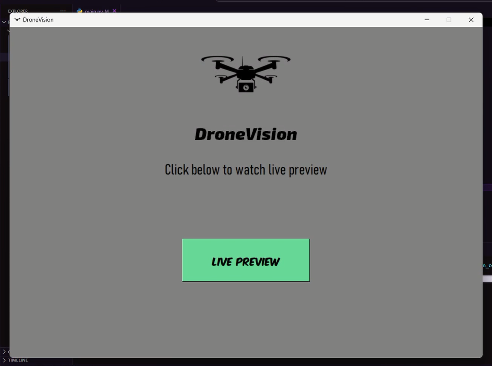
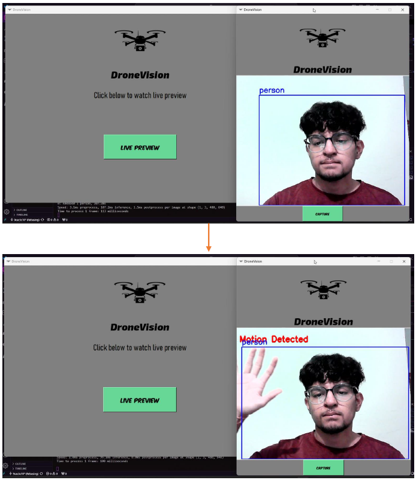
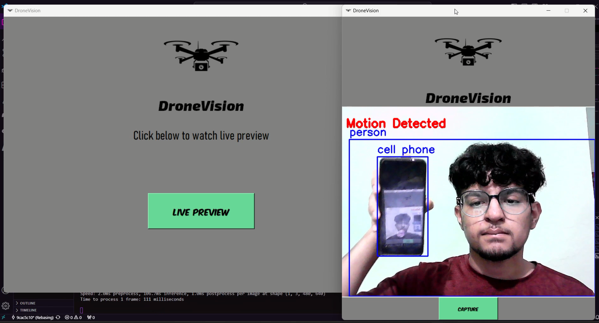
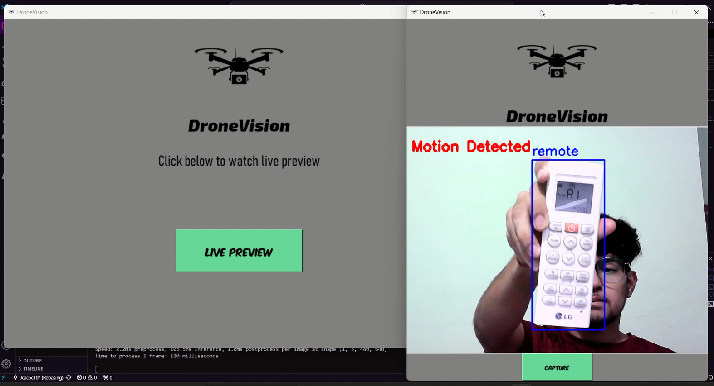
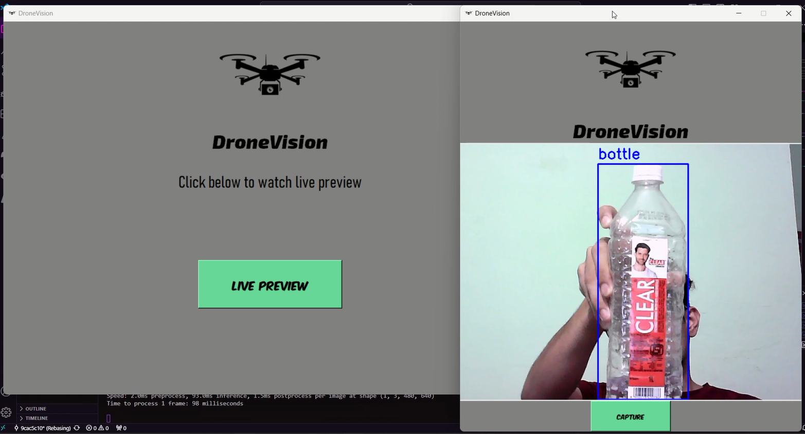

# NN based Detection and Classification of Streaming Images

## Surveillance System using YOLO v8

This project implements a real-time surveillance system using the YOLO v8 object detection algorithm in Python. The system can detect and track various objects in a video feed, making it suitable for applications in security and monitoring.

## Features
- Real-time object detection and tracking
- Integration with video feeds
- User-friendly GUI for ease of use
- Save detection results with timestamps

## Installation

### Prerequisites
Make sure you have Python 3.x installed on your system.

### Libraries
Install the required libraries using pip:

```bash
pip install opencv-python-headless
pip install Pillow
pip install ultralytics
```

### Additional Libraries
The following libraries are also used:
- `os`
- `datetime`
- `tkinter`

These are standard libraries that come with Python.

## Usage

1. **Clone the repository:**
   ```bash
   git clone https://github.com/mukul-anand-bhatt/NN-based-Detection-and-Classification-of-Streaming-Images.git
   cd NN-based-Detection-and-Classification-of-Streaming-Images
   ```

2. **Run the application:**
   ```bash
   python main.py
   ```
   <br>
   Tutorial - <https://youtu.be/l3YYAclkt1U>
   <br>
   <br>
   <div style="text-align: center;">
      <h2>Home screen</h2>
      
      <h2>Motion Detection</h2>
      
      <h2>Object Classification</h2>
      
      
      
      <hr>
   </div>

### GUI Components
- **Load Video:** Load a video file for processing.
- **Start Camera:** Start the webcam for real-time surveillance.
- **Save Results:** Save the detection results with bounding boxes and timestamps.

## Code Overview

### main.py
The main file that starts the application and initializes the GUI.
It also contains the logic for loading the YOLO v8 model and performing object detection on video frames.

## Libraries Used

```python
import os
import datetime
from tkinter import *
from PIL import ImageTk, Image
from tkinter import font, filedialog
import cv2
from ultralytics import YOLO
```

- **os**: For interacting with the operating system.
- **datetime**: For timestamping detection results.
- **tkinter**: For creating the graphical user interface.
- **PIL (Pillow)**: For handling image operations.
- **cv2 (OpenCV)**: For video processing and frame handling.
- **ultralytics**: For utilizing the YOLO v8 model for object detection.

## Contributing
Feel free to fork this project, submit pull requests, and contribute to improving the system. Any contributions are highly appreciated!

## Acknowledgements
- [YOLO (You Only Look Once)](https://github.com/ultralytics/yolov8) for the object detection model.
- [OpenCV](https://opencv.org/) for the computer vision library.
- [Pillow](https://python-pillow.org/) for image handling.
